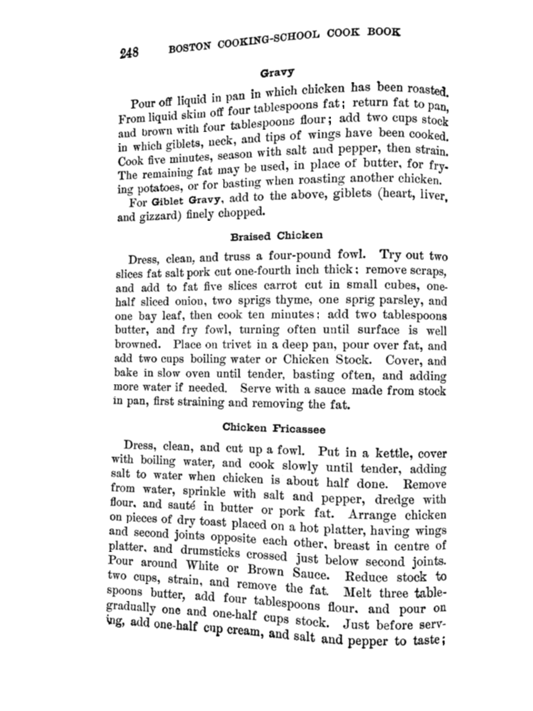
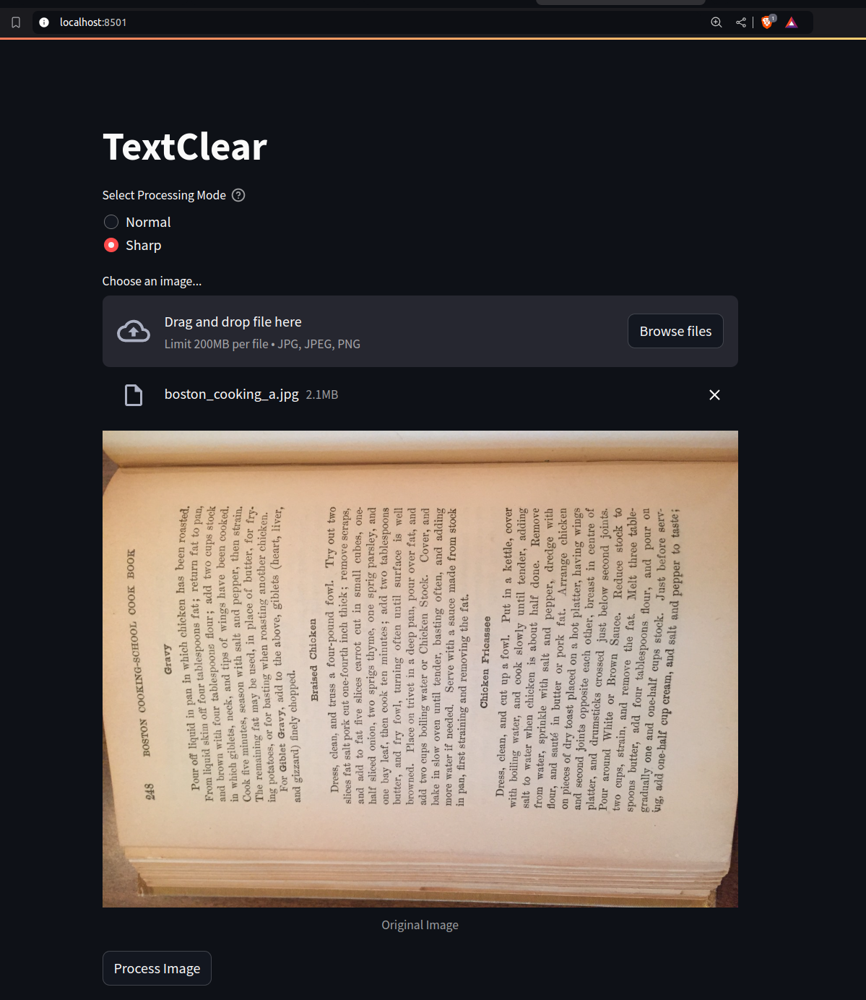
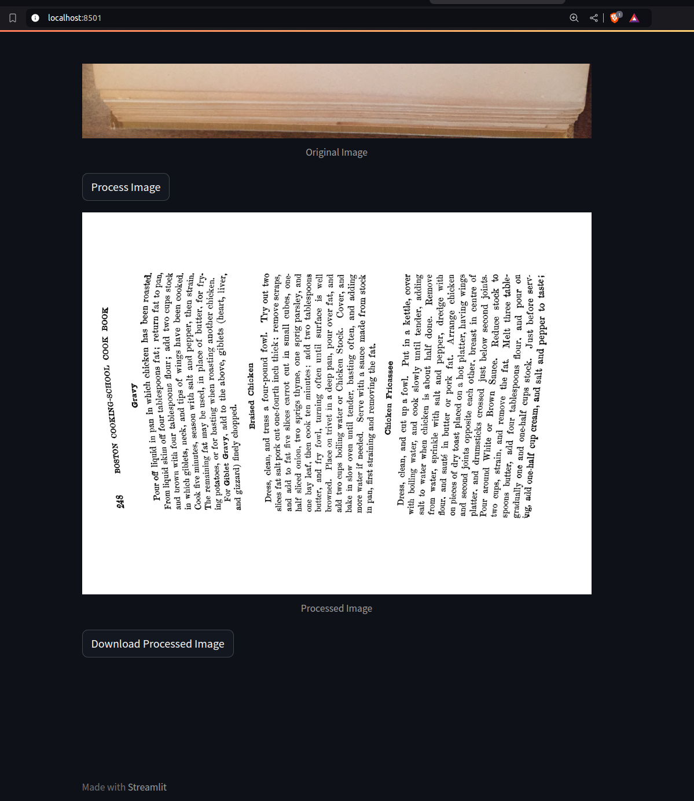

# ClearText

## What is ClearText? 🤔
ClearText is an AI-powered text detection and enhancement tool that helps make text in images more readable and clearer. Perfect for improving the legibility of text in scanned documents, photos, and other images.

## 💎 Support ClearText
If you find this tool useful, consider [becoming a sponsor](https://github.com/sponsors/ajinkya933) for $1/month and get priority support!


## Perfect For 🎯
- 📄 Document Digitization
- 📚 Book Scanning
- 📱 Mobile Photos of Text
- 🖨️ Improving Scanned Documents
- 📑 Text Enhancement in Images

# Demo
[](https://www.youtube.com/watch?v=hS363wB1pmU)
# Setup

## Prerequisites 📋
- Docker 🐳
- High-resolution text images 🖼️

## Directory Structure 📁
```

├── data/ # Add your high-res images here
├── onnx/ # ONNX model will be exported here
├── weights/ # model.onnx model goes here
├── outputs/ # Detection results will be saved here
├── Dockerfile
```

## Quick Start 🏃‍♂️

1. **Add Images and download pth file** 📸
   - Place your high-resolution text images in the `data` directory
   - Download pytorch model from [here](https://drive.google.com/file/d/12L_st5Z4-GDv5GNn-FZfVs9eKJ5ipGMY/view?usp=sharing), and save it in `weights` folder 

2. **Build Docker Image** 🔨
   ```bash
   docker build -t text-clear:latest .
   ````
3. **Run Docker Container** 🐳
   ```bash
   docker run -p 8501:8501 text-clear:latest
   ```
4. This runs the streamlit app on port 8501. Open your browser and go to http://localhost:8501 to use the app.
## 📸 Demo


Here's an example of what ClearText can do:

<table>
  <tr>
    <td><b>Input Image</b></td>
    <td><b>Output Image</b></td>
  </tr>
  <tr>
    <td></td>
    <td></td>
    
  </tr>

</table>


# 📋 Usage





1. Open the web interface
2. Select processing mode (Normal/Sharp)
3. Upload an image
4. Click "Process Image"
5. Download the processed result


## 💎 Sponsor $1 per month
👉 [My GitHub Sponsors link](https://github.com/sponsors/ajinkya933)


### 🌟 Sponsor Benefits
- 🛠️ Direct assistance with project-related issues and customizations
- 💡 Technical consultation for your specific use cases
- 🚀 Early access to new features and improvements
- ⭐ Recognition in our sponsors list

### Why Sponsor?
Your sponsorship helps maintain and improve ClearText, ensuring it remains a robust and reliable tool for the community. Every contribution, no matter how small, makes a difference!


## 📜 Licensing
- This project's core text detection is based on CRAFT (MIT License)
- Additional features and enhancements are available under dual licensing:
  
### Free License
- Non-commercial use
- Personal projects
- Academic research
- All original CRAFT features

### Commercial License
For business/commercial use of ClearText's enhanced features:
- Production-ready ONNX implementation
- Custom image enhancement pipeline
- Docker deployment
- Enterprise support

👉 [Contact for Commercial Licensing](mailto:ajinkyabobade93@gmail.com)

