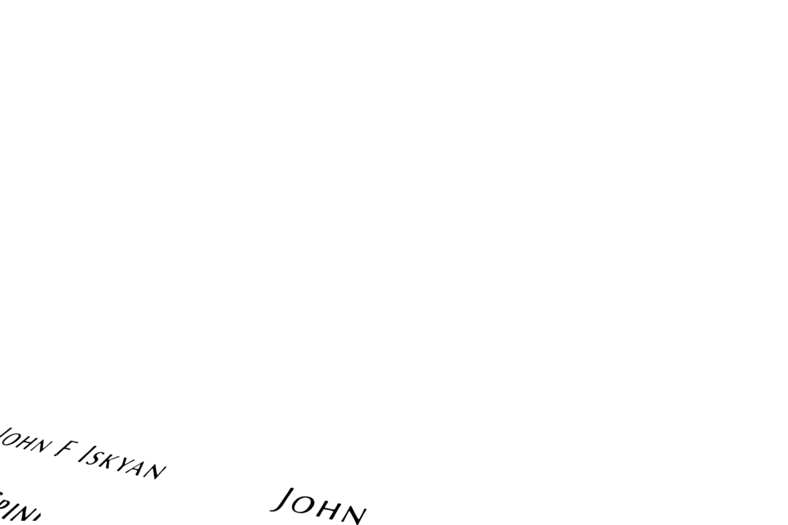

# ClearText OCR Desktop Application

This repository contains a desktop application version of ClearText OCR, allowing users to run the OCR functionality without requiring Docker or technical knowledge.

## Installation and Usage Options

### Option 1: Development Mode (Quick Start)

For development or personal use, this is the easiest way to run the application:

1. Clone or download this repository
2. Run `setup_dev.bat` to set up the development environment
3. Run `run_dev.bat` to start the application

This will open the application in a desktop window, providing the full functionality without packaging.

### Option 2: Distributable Installer

To create a packaged installer that you can distribute to others:

1. Clone or download this repository
2. Run `create_icon.bat` to generate an application icon (optional)
3. Run `build_app.bat` to build the application

This will:
- Create an installer in the `dist` folder
- Generate a portable version that doesn't require installation
- Create a shortcut in the current directory for easy access

The installer allows users to install the application like any standard Windows program, with desktop and start menu shortcuts.

## Build Options

### Different Types of Builds

The following build options are available:

- **Development Mode**: Run the application directly without packaging
  - Setup: `setup_dev.bat`
  - Run: `run_dev.bat`

- **Installer**: Build an NSIS installer (.exe)
  - Creates a standard Windows installer
  - Generated at `dist/ClearText OCR-1.0.0.exe`

- **Portable**: Build a portable version (.exe)
  - Doesn't require installation
  - Generated at `dist/ClearText OCR-Portable-1.0.0.exe`

### Manual Build Commands

For advanced users, you can run these npm commands directly:

```
npm start             # Run in development mode
npm run build         # Build with default settings
npm run build-nosign  # Build without signing (for systems without admin privileges)
```

## Troubleshooting

If you encounter any issues:

1. **Application doesn't start**:
   - Make sure Python and all dependencies are installed
   - Check the logs in the console window

2. **Build errors**:
   - Try running as Administrator
   - Use the `build-nosign` option to bypass code signing

3. **Module errors**:
   - The application automatically creates missing modules
   - Check if antivirus is blocking file creation

## Directory Structure

- `app.py` - Main Python application
- `main.js` - Electron entry point
- `setup.py` - Dependency setup script
- `windows_install.bat` - Python dependencies installer
- `setup_dev.bat` - Development environment setup
- `run_dev.bat` - Run in development mode
- `build_app.bat` - Build distributable versions
- `create_icon.bat` - Generate application icon

# ClearText

## What is ClearText? 🤔
ClearText is an AI-powered text detection and enhancement tool that helps make text in images more readable and clearer. Perfect for improving the legibility of text in scanned documents, photos, and other images.

## 💎 Support ClearText
If you find this tool useful, consider [becoming a sponsor](https://github.com/sponsors/ajinkya933) for $1/month and get priority support!


## Perfect For 🎯
- 📄 Document Digitization
- 📚 Book Scanning
- 📱 Mobile Photos of Text
- 🖨️ Improving Scanned Documents
- 📑 Text Enhancement in Images

# Demo
[](https://www.youtube.com/watch?v=hS363wB1pmU)


## ⚠️ Important Requirements

### Image Dimensions
- 🖼️ Minimum required dimensions:
  ```
  Width:  1280 pixels
  Height: 960 pixels
  ```
- ❌ Images smaller than these dimensions may produce poor results
- ✅ Larger images will be automatically resized while maintaining aspect ratio
- 💡 For best results, use high-resolution images (2000x1500 or larger)

# Setup

## Prerequisites 📋
- Docker 🐳
- High-resolution text images 🖼️

## Directory Structure 📁
```

├── data/ # Add your high-res images here
├── onnx/ # ONNX model will be exported here
├── weights/ # model.onnx model goes here
├── outputs/ # Detection results will be saved here
├── Dockerfile
```

## Quick Start 🏃‍♂️

1. **Add Images and download pth file** 📸
   - Place your high-resolution text images in the `data` directory
   - Download pytorch model from [here](https://drive.google.com/file/d/12L_st5Z4-GDv5GNn-FZfVs9eKJ5ipGMY/view?usp=sharing), and save it in `weights` folder 

2. **Build Docker Image** 🔨
   ```bash
   docker build -t text-clear:latest .
   ````
3. **Run Docker Container** 🐳
   ```bash
   docker run -p 8501:8501 text-clear:latest
   ```
4. This runs the streamlit app on port 8501. Open your browser and go to http://localhost:8501 to use the app.
## 📸 Demo


Here's an example of what ClearText can do:

<table>
  <tr>
    <td><b>Input Image</b></td>
    <td><b>Output Image</b></td>
  </tr>
  <tr>
    <td></td>
    <td></td>
    IMG_0274.JPG
  </tr>
  <tr>
    <td></td>
    <td></td>
    IMG_0274.JPG
  </tr>

</table>


# 📋 Usage


1. Open the web interface
2. Select processing mode (Normal/Sharp)
3. Upload an image
4. Click "Process Image"
5. Download the processed result


## 💎 Sponsor $1 per month
👉 [My GitHub Sponsors link](https://github.com/sponsors/ajinkya933)


### 🌟 Sponsor Benefits
- 🛠️ Direct assistance with project-related issues and customizations
- 💡 Technical consultation for your specific use cases
- 🚀 Early access to new features and improvements
- ⭐ Recognition in our sponsors list

### Why Sponsor?
Your sponsorship helps maintain and improve ClearText, ensuring it remains a robust and reliable tool for the community. Every contribution, no matter how small, makes a difference!


## 📜 Licensing

This project consists of two parts with different licensing terms:

### Core Components (MIT License)
- The core text detection functionality based on CRAFT
- Basic image processing features
- Available under the MIT License

### Enhanced Features (Commercial License)
The following features require a commercial license for business/commercial use:
- Production-ready ONNX implementation
- Custom image enhancement pipeline
- Docker deployment configuration
- Enterprise support
- Advanced UI features

For commercial licensing inquiries:
👉 [Contact for Commercial License](mailto:ajinkyabobade93@gmail.com)

Note: Personal, academic, and non-commercial use of all features is permitted under the MIT License.

